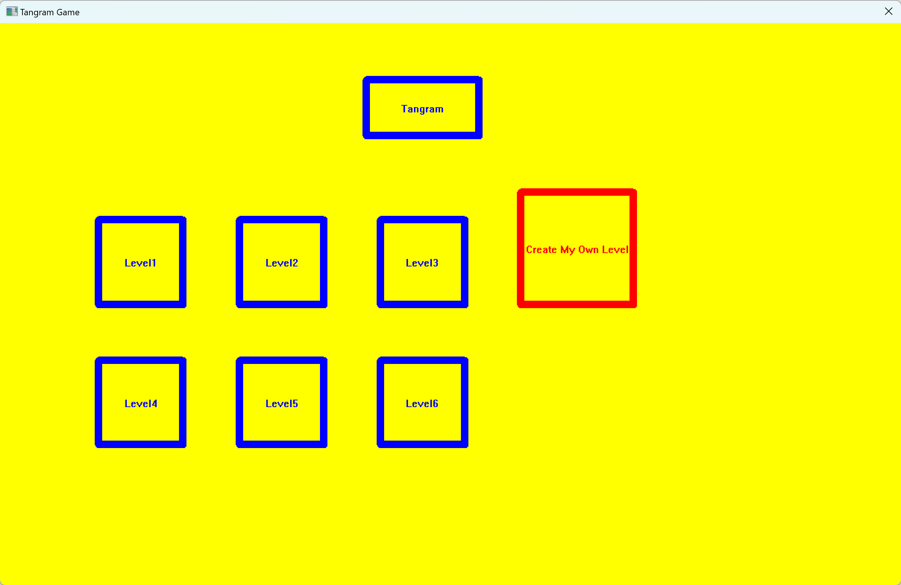
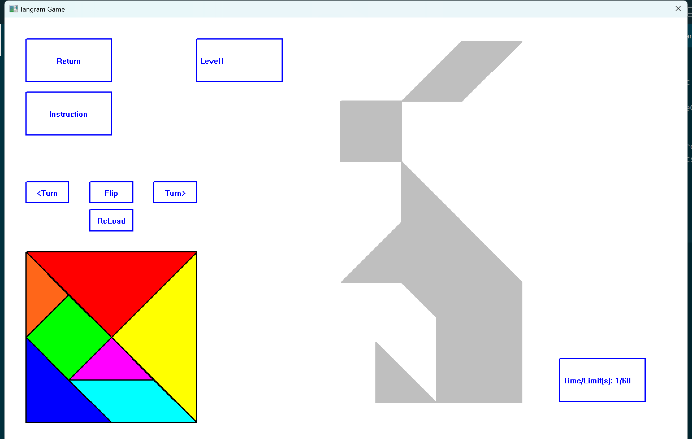
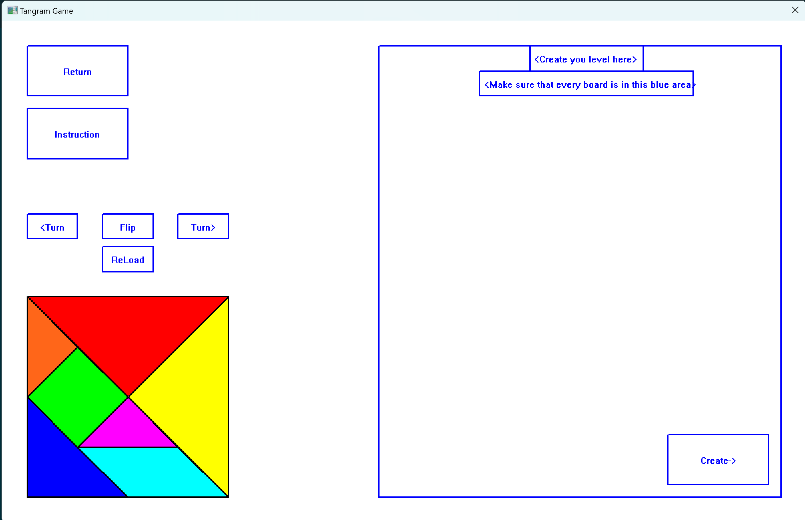

## Tangram
The final project of the C programing lesson, the work was done by me and another group student.

It accomplishes the tangram game, a traditional Chinese game, using the graphics library SimpleGUI provided by teacher.

What we've' done was to compose the simple lines and circles to be a basic graphic, and then create the mouse and keyboard response function to let the graphics react towards mouse and keyboard events, thus we can use mouse to move the graphics around.

## Demo

You can choose from levels that's set up already, and in each level, there will be a counting down, if the player fails to finish in time, the program will automatically return to the start menu. 

You can rotate the board and move the board around, when the board was around the target position, there will be an automatic match.

You can also create your own Tangram graphics, but this function still has a small bug.

## Run

The code is initially developed with Dev C++, so you can unzip the zip file, run `unzip Lib.zip`, and acquire the required lib, the simpleGUI and LibGraphics, then use Dev C++ open the .dev file.

Or simplely after unzip, run the .exe file, and you can simply open the game.

